# TrackSense - Serveur Web

> Ce dépôt fait parti du projet [TrackSense](https://github.com/DFC-Informatique-Cegep-de-Sainte-Foy/TrackSense) développé par des étudiants du programme [Techniques de l'informatique - Programmation, bases de données et serveurs](https://dfc.csfoy.ca/retourner-aux-etudes/programmes-a-temps-plein/informatique/techniques-de-linformatique-programmation-bases-de-donnees-et-serveurs-dec-accelere/) du cégep de Ste-Foy, dans le cadre de leur projet de synthèse.
> Le serveur Web est une API REST permettant de communiquer avec la base de données TrackSense.
> Elle est utilisée par l'application mobile.
> Elle est écrite en C#.

---

Dans ce projet, nous hébergeons le serveur et la base de données sur https://www.smarterasp.net , pour les principales raisons suivantes:

- Essai gratuit de 60 jours
- SSL gratuit
- Pas de carte de crédit nécessaire

## Hébergement du serveur et base de données en ligne
1. Créer un compte sur https://www.smarterasp.net. Après vous être connecté au site, clique sur button Try now:
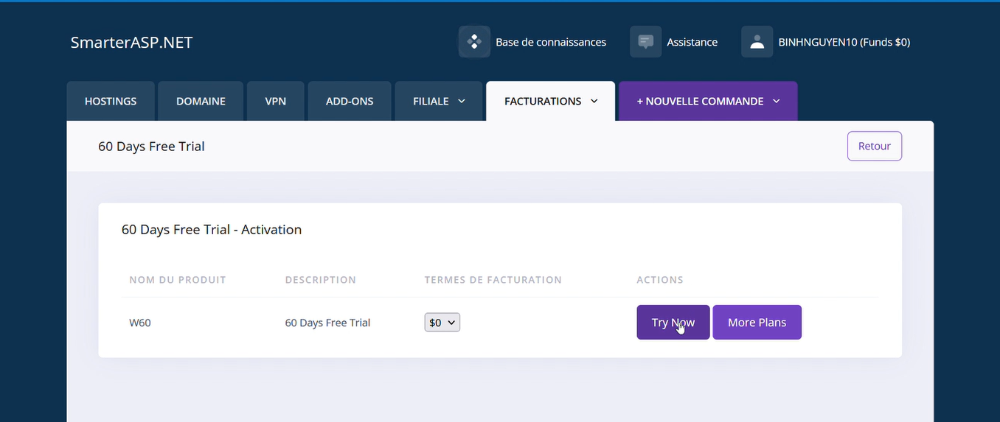

2. Vous serez diirrigé vers la page Hostings info, après avoir rempli le formulaire, cliquez **Next**
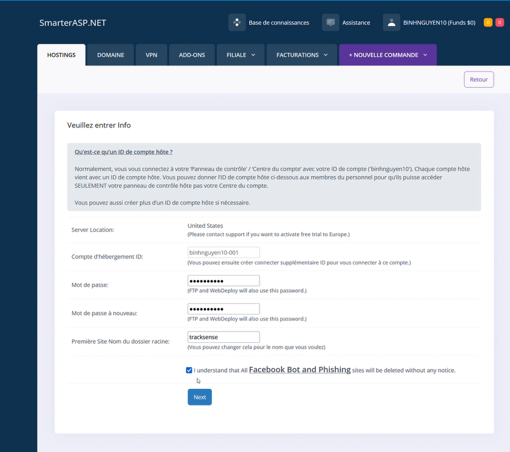

3. et puis cliquez **Soumettre**

4. Vous devez attendre du 1 à 3 miniutes avant que votre hébergement soit prêt.
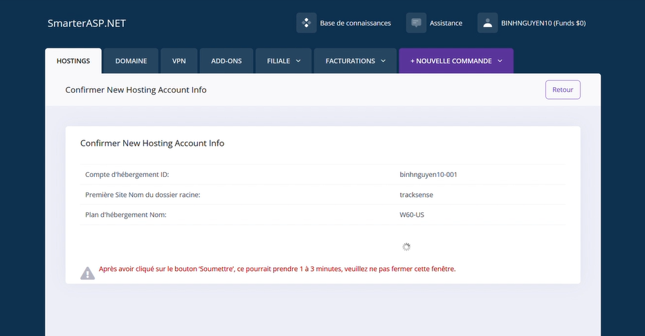

5. Lorsque l'hébergement sera prêt vous verrez la page ci-dessous, vous cliquerez sur la boutton **connection CP**
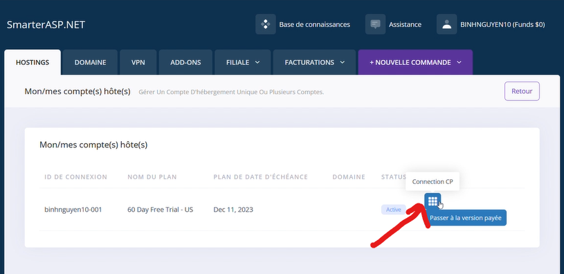

6. Nous allons maintenant devoir récupérer les paramètres du site Web qui seront utilisés pour que Visual Studio publie le serveur sur l'hébergement. Vous devrez cliquer sur la petite flèche (étape 1) puis cliquer sur le bouton « Get Publish Setting »
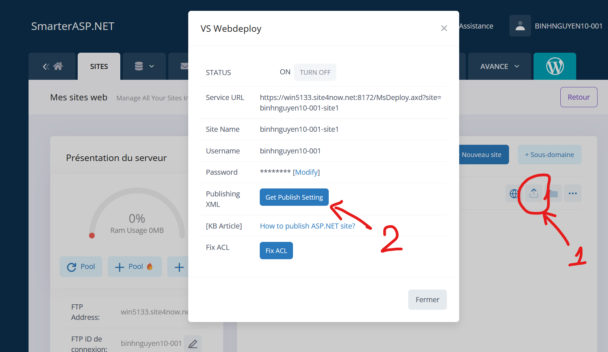

7. Vous devez saugarchez ce fichier .Publish Settings dans votre ordinateur.
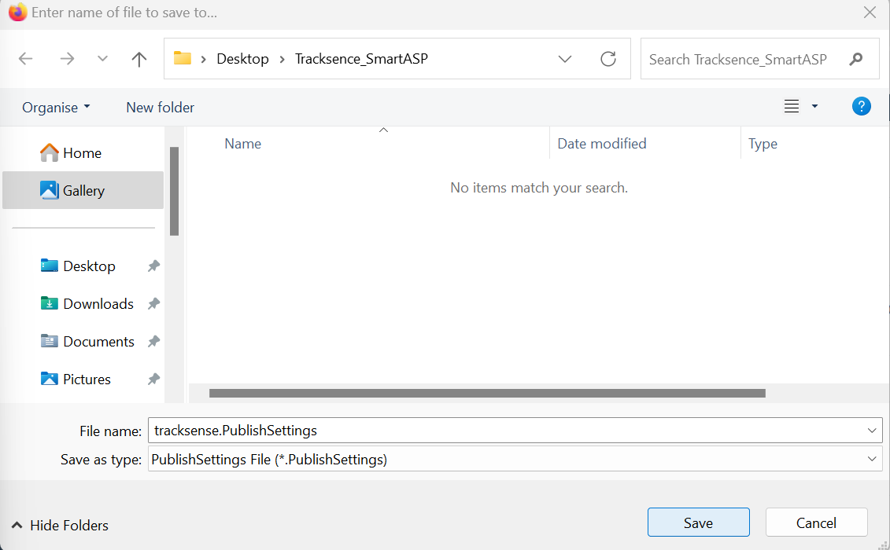

8. Parce que notre site Web a besoin d'une base de données. SmarterASP.net nous propose deux options: MySQL et SQLServer. Dans ce projet nous choisissons MySQL. Donc, vous suivez ces étapes
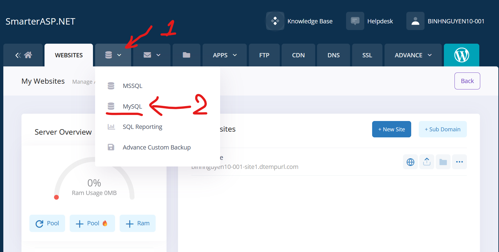

9. Puis vous cliquez Ajouter une base de données:

10. Choisissez nom de la base de données et mot de passe et cliquez soumettre:
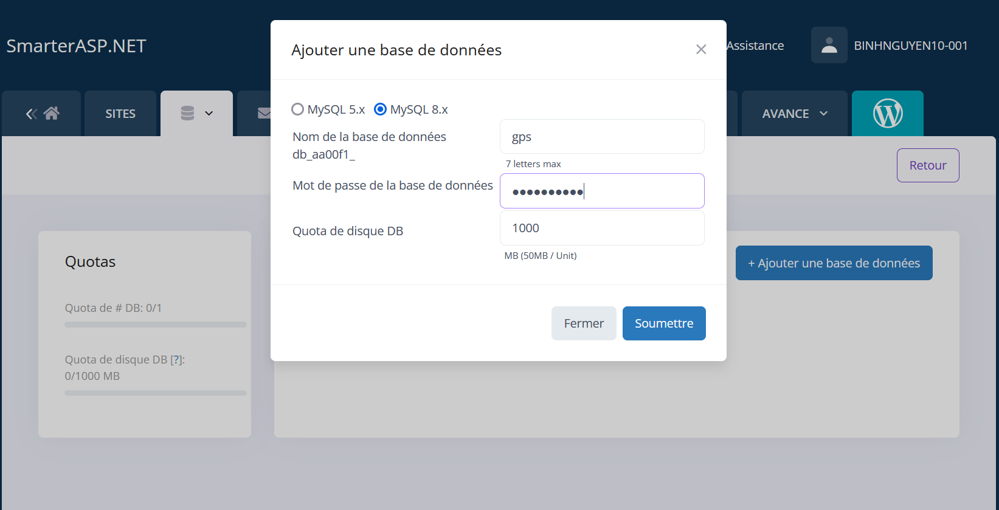

11. Vous allez voir la page suivante qui vous dire ce que la base de données a été créée avec succès.
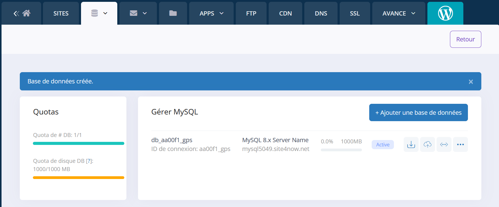

12. vous retrouverez les chaînes de connexion en cliquant sur le petit bouton (bouton 1).
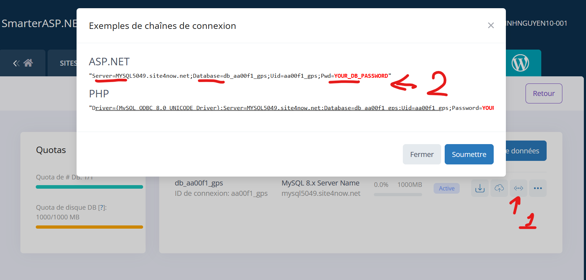

13. Prenez une note de la chaîne de connexion et mettez à jour : connectionStrings dans fichier appsettings.json

14. Ouvrez votre solution avec Visual studio, et la publier avec option Import Profile et sélectionez le fichier .publishSettings que vous avez saugardez dans étape 7.
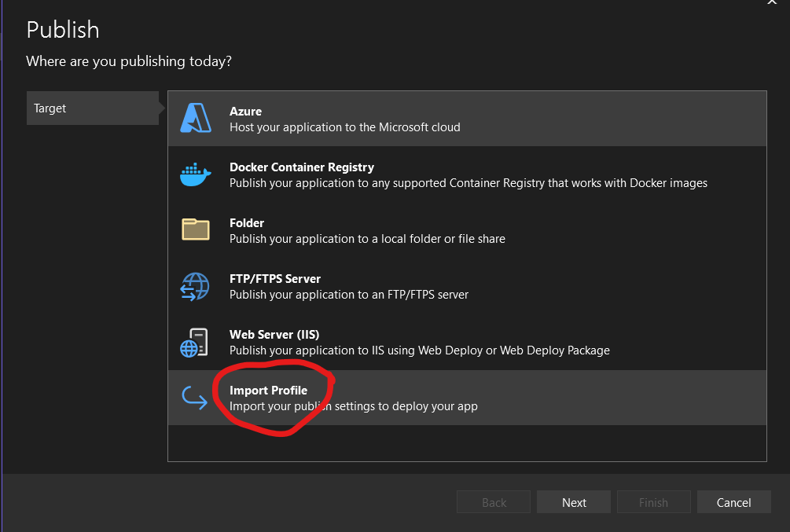
 
15. Vous pouvez maintenant publier votre serveur sur l'hébergement.
Nous ferons la création d'un objet connecté nommé le TrackSense. Cette objet sera principalement utilisé sur un vélo ou un piéton.
